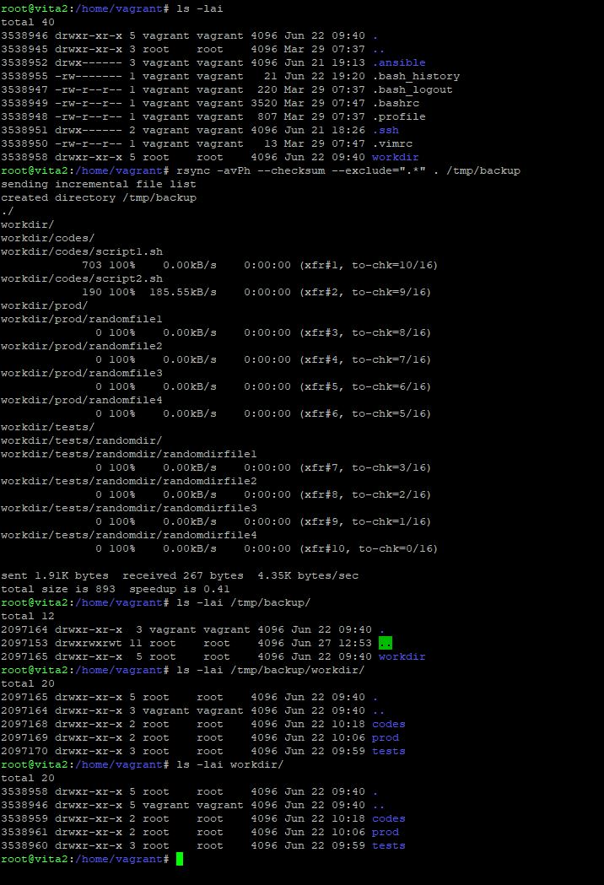

# Домашнее задание к занятию 3 "Резервное копирование" - Лебедев Алексей, fops-10


---

### Задание 1  

- Составьте команду rsync, которая позволяет создавать зеркальную копию домашней директории пользователя в директорию /tmp/backup
- Необходимо исключить из синхронизации все директории, начинающиеся с точки (скрытые)
- Необходимо сделать так, чтобы rsync подсчитывал хэш-суммы для всех файлов, даже если их время модификации и размер идентичны в источнике и приемнике.
- На проверку направить скриншот с командой и результатом ее выполнения

### Решение:    

- Напишем команду rsync, удовлетворяющую условиям нашей задачи:

```
rsync -avPh --checksum --exclude=".*" . /tmp/backup
```

где:  

- a (или --archive): выполняет рекурсивную копию и сохраняет атрибуты файлов и директорий;
- v (или --verbose): выводит подробную информацию о процессе синхронизации;
- P (или --progress): отображает прогресс передачи файлов и позволяет возобновлять прерванные операции;
- h (или --human-readable): выводит размеры файлов в human-readable формате
- --checksum: вычисляет хэш-суммы для всех файлов и сравнивает их между источником и приемником.
- --exclude=".*": исключает все директории, начинающиеся с точки

Проверим:  


  
  

  
  
